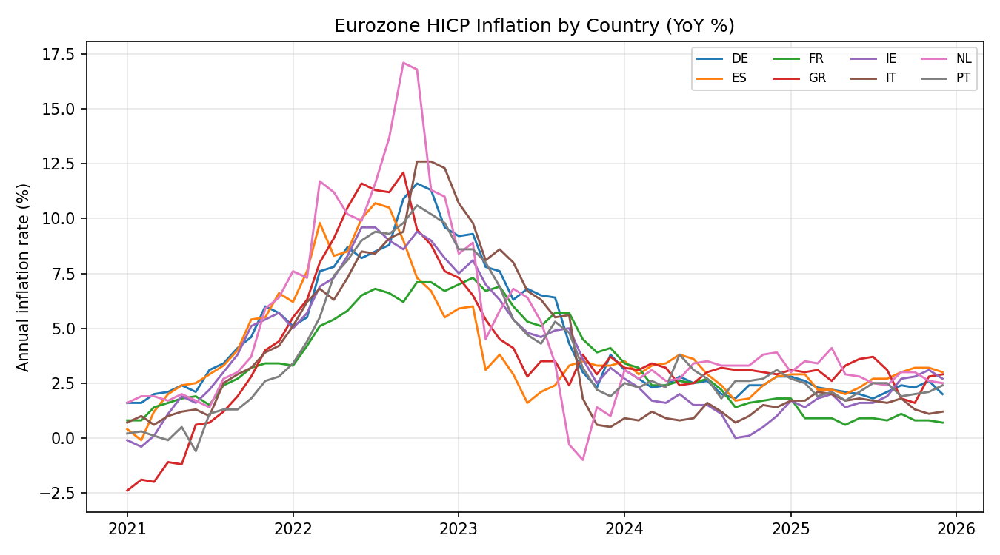
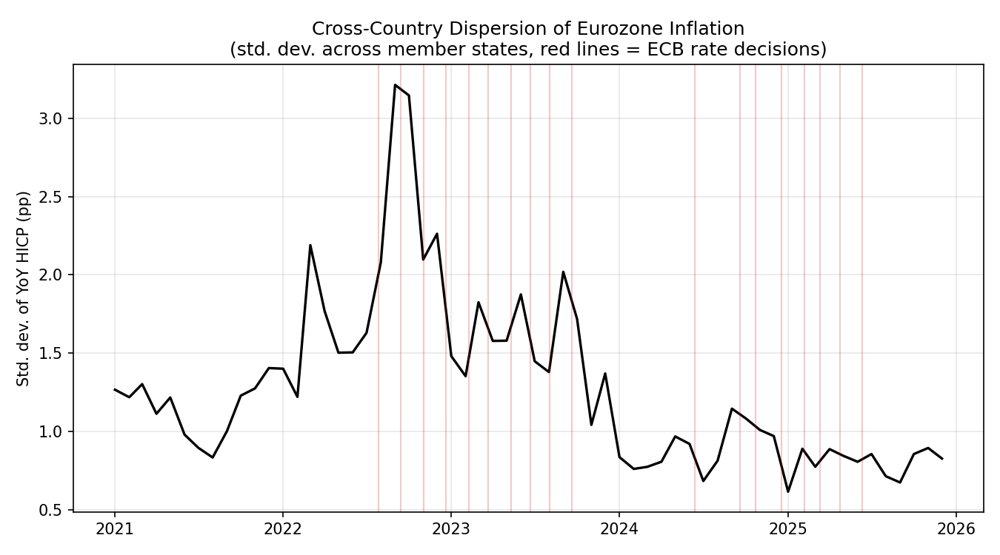

# Analysis of Numbers on Eurozone Inflation dispersion following ECB new rate decisions

Built during my ECB internship follow-up work — a self-directed analysis
of how inflation dispersion across euro-area member states has moved
around the ECB's rate decisions.

## Methods used:

- Data: Monthly HICP (Harmonised Index of Consumer Prices), annual rate of change, for 8 euro-area member states — Germany, France, Italy, Spain, Netherlands, Ireland, Portugal, Greece — [ECB Data Portal](https://data.ecb.europa.eu/) public API.
- Dispersion metric: cross-country standard deviation of YoY inflation, computed per month.
- Comparison: average dispersion in the six months before vs. six months after the ECB's first rate cut (12 June 2024).


## Findings:

We see that the cross-country dispersion of EUROZONE HICP inflation rose sharply through the year 2022, which was driven by outlying countries such as the Netherlands (in this case peaking above 17% YoY), with that diverging sharply from lower-inflation countries like France which peaked close to 7% YoY, then reaching a high of 3.2 percentage points late in 2022. Dispersion then shrunk steadily through 2023, falling to 0.84 percentage points in the half year leading up to the ECBs first rate cut on the 12th of June 2024 and then remaining broadly flat at 0.95pp in the six months following. These findings suggest that inflation convergence across member states had occurred before the ECB implemented its easing methods, rather than being a result of easing.

## Charts





## Repo contents

- `hicp_dispersion.py` — fetch, clean, analyse, and chart
- `1_trajectories.png`, `2_dispersion.png`, `3_before_after.png` — the three charts above
- `README.md` — this file

## Run it yourself

```
pip install pandas requests matplotlib
python hicp_dispersion.py
```

The ECB Data Portal API query URL is already filled in at the top of the
script (`API_URL`) — see the comment there if you want to change the
country set.

## Data source

European Central Bank, [Data Portal](https://data.ecb.europa.eu/) — HICP,
Overall index, Annual rate of change.
